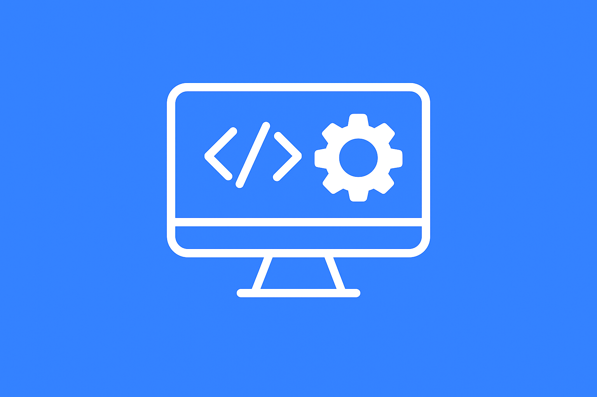

# 👋 Hi, I'm Lin-Bee

단순한 기술 구현을 넘어 사용성과 흐름을 함께 고민해왔습니다.
풀스택 구조를 이해하고, 데이터 흐름과 사용자 경험을 함께 설계할 수 있는
열정 가득한 신입 개발자입니다.

---

## 🧰 Tech Stack

**Frontend**  
React • React Native • Redux • TailwindCSS • TypeScript • SCSS

**Backend**  
Java 17 • Spring Boot • MyBatis

**Database & Infra**  
PostgreSQL • MySQL • Redis

**CI/CD & 기타**  
Git • GitHub • Swagger • Figma 

---

## 🚀 주요 프로젝트

| 프로젝트 | 설명 | 링크 |
|----------|------|------|
| **스마트팜 IoT 통합 시스템** | 실시간 센서 데이터 수집 및 관리자 제어 기능 | [🔗 자세히 보기](https://github.com/Lin-Bee/naeunminchocofarm_api_web) |
| **React Native 앱 대시보드** | 농장 구역별 센서 시각화, 토글뷰 UI | [🔗 미리보기](https://github.com/Lin-Bee/naeunminchocofarm_mobile) |
| **JAVA API** | 농장 구역별 센서 시각화, 토글뷰 UI | [🔗 미리보기](https://github.com/Lin-Bee/naeunminchocofarm_api) |

🧩 주요 기능 보기

 

### 사용자 기능 (USER)
- 🌡️ 구역별 센서 데이터 수집 (온도, 습도, 조도 등)
- 📊 센서 상태값 시각화 (이상 여부 강조 표시)
- 📂 구역별 센서 목록 토글 및 구분
- ⚙️ 제어기 설정 페이지 이동 (설정값 수정은 별도 페이지)
- 🧑‍💼 마이페이지 내 정보 수정 및 비밀번호 변경
- 📝 스마트팜 서비스 신청 기능  
  - 신청자 유형, 지역, 연락처, 상담 내용 등 입력  
  - 신청 후 상태는 '신청대기'로 고정 저장

### 관리자 기능 (ADMIN)
- 📥 서비스 신청 내역 목록 및 상세 보기  
  - 신청자 정보, 상태, 메모 확인  
  - 상태 변경(상담대기, 상담중, 상담완료 등)
- 🗂 신청 상세 수정 (상태 + 메모)
- 📈 구역별 센서 목록 및 최근 데이터 조회
- 🧭 관리자 페이지는 일반 사용자와 완전 분리

### 인증 및 보안
- 🔐 JWT 기반 로그인/인증 처리
- 🔄 로그인 상태 유지 및 토큰 만료 처리
- 🧾 권한별 메뉴 및 접근 제어  
  - `fammer`만 마이팜 접근 가능  
  - `admin`만 관리자페이지 접근 가능
- ☑️ 이메일 중복 확인 / 아이디 중복 확인

### UI/UX 및 기타
- 🧭 React + Redux 상태관리 구조 구성
- 🧩 routesLink 기반 자동 라우팅 및 메뉴 구성
- 📆 Dayjs 활용한 날짜 표시
- 🖼️ 스마트 대시보드형 UI 적용

<table>
  <tr>
    <td align="center"> <strong>기획 & 설계</strong></td>
    <td align="center"> <strong>개발 & 연동</strong></td>
    <td align="center"> <strong>테스트 & 개선</strong></td>
  </tr>
</table>

<!-- | **포트폴리오 사이트** | HTML 기반 반응형 자기소개 페이지 | [🔗 바로가기](https://lin-bee.github.io) | -->

---

## 📁 그 외 프로젝트

| 프로젝트 | 상태 | 기간 | 설명 |
|----------|------|------|------|
| **쇼핑몰** | (진행) | 2025.04 ~ 2025.05 | [전자상거래 기반 브랜드 사이트] (프론트/백엔드) [🔗 미리보기](https://github.com/Lin-Bee/greenclass/tree/main/workspace_react/book_shop) |
| **쇼핑몰** | (진행) | 2025.04 ~ 2025.05 | [전자상거래 기반 브랜드 사이트] (프론트/백엔드) [🔗 미리보기](https://github.com/Lin-Bee/greenclass/tree/main/workspace_react/book_shop) |

---

## 📬 마무리

📧 lin_bee@naver.com

